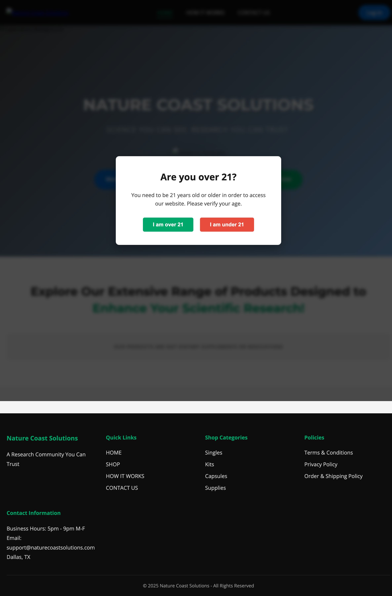

# Nature Coast Solutions Website

A modern, responsive e-commerce website for Nature Coast Solutions, featuring research products and a comprehensive ordering system.

## 🌟 Features

- **Multi-page Website**: Home, How It Works, Contact, and Shop pages
- **Age Verification**: Modal to verify user age (21+) before accessing the site
- **Product Catalog**: 59+ products organized by categories (Singles, Kits, Supplies)
- **Interactive Shopping Cart**: Real-time updates with quantity selectors
- **Responsive Design**: Mobile-first approach with dedicated mobile menu
- **Docker Ready**: Containerized deployment with nginx optimization
- **Performance Optimized**: Gzip compression, caching headers, and minified assets

## 📸 Screenshot



## 📁 Project Structure

```text
naturecoast-website/
├── index.html              # Homepage with hero section
├── how-it-works.html       # Service explanation and process
├── contact.html            # Contact form and information
├── shop.html               # Product catalog and ordering
├── css/
│   ├── main.css           # Core styles and components
│   ├── responsive.css     # Mobile/tablet breakpoints
│   ├── how-it-works.css   # How it works page styles
│   ├── contact.css        # Contact page styles
│   └── shop.css           # Shop and cart styles
├── js/
│   ├── main.js            # Core functionality, navigation
│   └── shop.js            # Shopping cart logic
├── assets/                # Images and media files
├── Dockerfile             # Container configuration
├── docker-compose.yml     # Docker orchestration
└── nginx.conf            # Web server configuration
```

## 🎯 Customer Requests

### 1. Cryptocurrency Payment Integration (5% Discount)

**Objective**: Implement crypto payment processing with automatic 5% discount to reduce transaction fees and attract crypto-savvy customers.

**Payment Gateway Options**:

- **Coinbase Commerce** (Recommended)
  - Pros: Easy integration, automatic USDC conversion, 1% fee, Shopify/WooCommerce plugins, no chargebacks
  - Cons: Limited to specific networks (Base, Ethereum, Polygon)
  - Implementation: API integration or pre-built plugins

- **NOWPayments**
  - Pros: 300+ cryptocurrencies, 0.4-0.5% fees, non-custodial options
  - Cons: Less established brand, may require more customer education
  - Implementation: REST API with webhooks

- **BTCPay Server**
  - Pros: Zero fees, complete control, privacy-focused, open-source
  - Cons: Self-hosted (requires technical expertise), Bitcoin-only by default
  - Implementation: Docker deployment with Lightning Network support

- **BitPay**
  - Pros: Established since 2011, regulatory compliant, crypto debit card option
  - Cons: Higher fees (1-2%), more centralized
  - Implementation: Direct API or e-commerce plugins

**Technical Requirements**:
- Wallet management system (hot/cold wallet strategy)
- Real-time price conversion API
- Automatic discount calculation at checkout
- Transaction monitoring and reconciliation
- Tax reporting integration

### 2. Members-Only Product Section

**Objective**: Create a gated area for vetted customers with exclusive access to actual product listings.

**Authentication & Authorization System**:
- User registration with email verification
- Admin approval workflow for membership requests
- Role-based access control (Guest, Pending, Member, Admin)
- Session management with JWT tokens
- Password recovery and two-factor authentication (2FA)

**Member Portal Features**:
- Personalized dashboard with order history
- Exclusive product catalog with member pricing
- Saved payment methods and shipping addresses??
- Wishlist and product notifications
- Referral program tracking??

**Admin Vetting Tools**:
- Application review queue with user verification
- Background check integration (optional)
- Manual approval/rejection with notes
- Member status management (active, suspended, revoked)
- Audit trail for all admin actions

### 3. Product & Inventory Management System

**Objective**: Build a comprehensive database-driven system for the owner to manage products, inventory, and users efficiently.

**Database Architecture**:
- **PostgreSQL** or **MySQL** for relational data, **NoSQL** alternative as well.
- Tables: products, inventory, users, orders, transactions, audit_logs
- Real-time inventory tracking with stock alerts
- Product variants (size, potency, packaging)
- Batch tracking for compliance

**Admin Dashboard Features**:
- **Product Management**:
  - CRUD operations for all products
  - Bulk import/export (CSV, Excel)
  - Image upload with CDN integration
  - SEO metadata management
  - Category and tag organization

- **Inventory Control**:
  - Real-time stock levels
  - Low stock alerts and automatic reorder points
  - Supplier management
  - Cost tracking and profit margin analysis
  - Expiration date tracking for perishables

- **User Management**:
  - Customer profiles with purchase history
  - Membership tier management
  - Communication tools (email, SMS)
  - Customer analytics and segmentation
  - Export capabilities for marketing

**Technology Stack Recommendations**:
- Backend: Node.js with Express or Python with Django/FastAPI
- Database: PostgreSQL with Redis for caching
- Admin UI: React Admin or custom React/Vue dashboard
- API: RESTful or GraphQL
- Hosting: AWS/Google Cloud with auto-scaling

## 🚀 Quick Start

### Local Development

```bash
# Navigate to website directory
cd naturecoast-website

# Start Python HTTP server
python3 -m http.server 8000

# Visit http://localhost:8000
```

### Docker Deployment

```bash
# Build and start container
docker-compose up -d

# Visit http://localhost:8080

# Stop container
docker-compose down
```

### Production Build

```bash
# Build Docker image
docker build -t naturecoast-website .

# Run container
docker run -d -p 80:80 naturecoast-website
```

## 💻 Technologies Used

- **Frontend**: HTML5, CSS3, Vanilla JavaScript
- **Styling**: Custom CSS with CSS Variables for theming
- **Fonts**: Google Fonts (Montserrat, Open Sans)
- **Container**: Docker with Alpine Linux
- **Web Server**: Nginx with performance optimization
- **Version Control**: Git

## 📱 Browser Support

- Chrome (latest)
- Firefox (latest)
- Safari (latest)
- Edge (latest)
- Mobile browsers (iOS Safari, Chrome Mobile)

## 🛍️ Product Categories

### Singles

Individual vials for specific research needs

### Kits

- Full kits (10 vials)
- Half kits (5 vials)
- Bundled products with member discounts

### Supplies

- Bacteriostatic water
- Needles and syringes
- Shipping options

## 💳 Payment Integration

Currently supports manual payment processing via:

- Zelle
- Chime
- CashApp
- Venmo

## 🔒 Security Features

- Age verification (21+ requirement)
- Secure headers configuration
- XSS protection
- Click-jacking prevention
- Research-only product disclaimers

## 📈 Performance

- **Page Load**: < 2 seconds
- **Lighthouse Score**: 90+
- **Mobile Ready**: 100% responsive
- **SEO Optimized**: Meta tags and structured content

## 🛠️ Customization

### Updating Products

Edit the products array in `js/shop.js`:

```javascript
let products = [
    { id: 1, name: 'Product Name', price: 25.00, category: 'supplies' },
    // Add more products...
];
```

### Changing Colors

Modify CSS variables in `css/main.css`:

```css
:root {
    --primary-color: #1a1a1a;
    --secondary-color: #0066cc;
    --accent-color: #00a86b;
}
```

### Adding Pages

1. Create new HTML file
2. Include standard header/footer
3. Add corresponding CSS file
4. Update navigation in all pages

## 📝 Important Notes

- All products are for research purposes only
- Not for human, animal, or therapeutic use
- Age verification required (21+)
- Continental US shipping only

## 🤝 Support

For questions or support:

- Email: `support@naturecoastsolutions.com`
- Business Hours: 5pm - 9pm M-F CST
- Location: Dallas, TX

## 📄 License

© 2025 Nature Coast Solutions - All Rights Reserved

---

**Disclaimer**: This website and all products are intended for laboratory, scientific, and research purposes only. Products are not approved by the FDA for human or veterinary use.